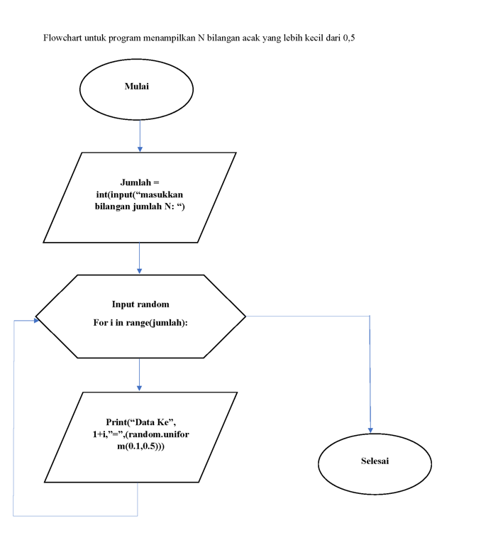
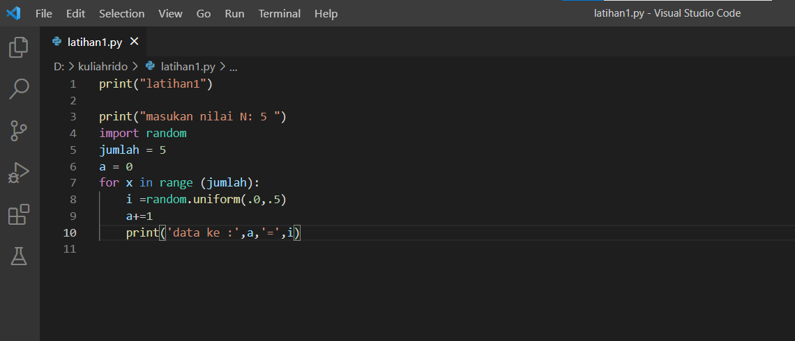
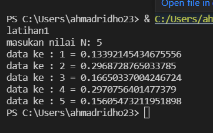
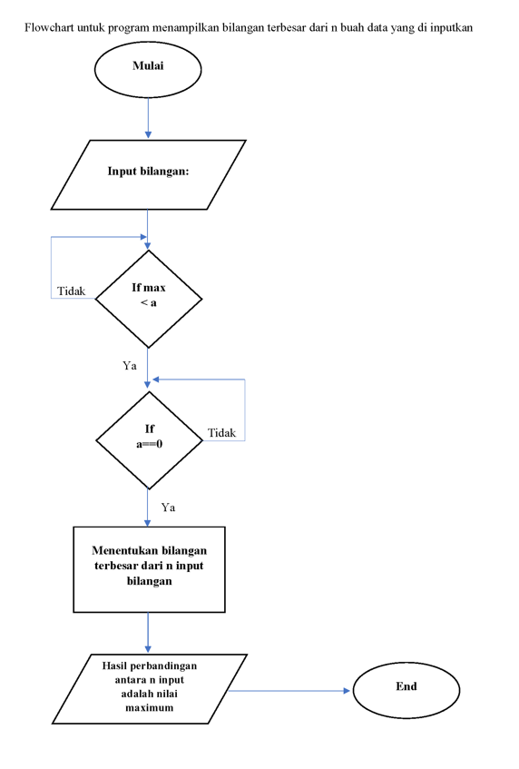
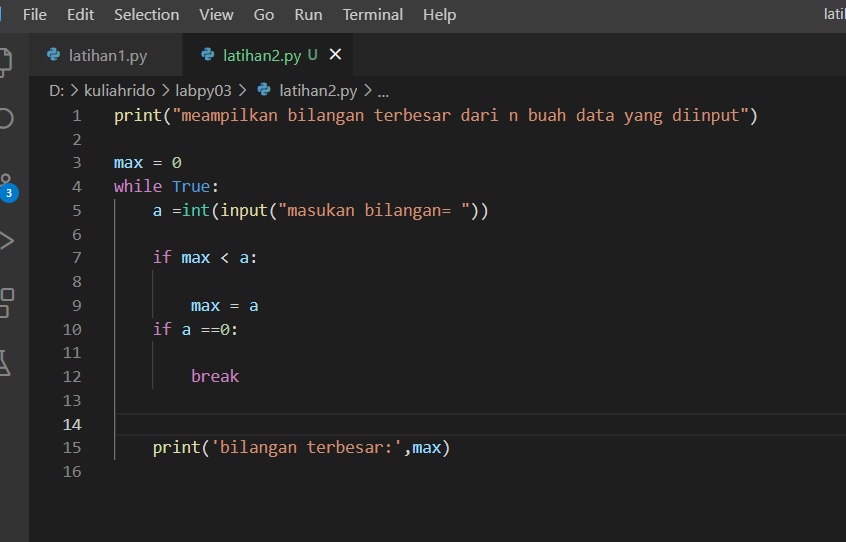
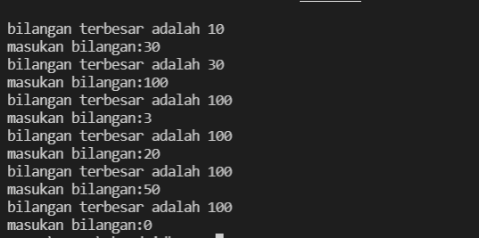
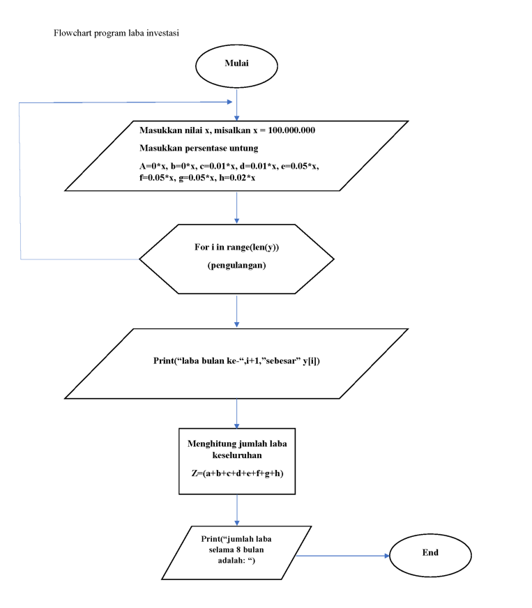
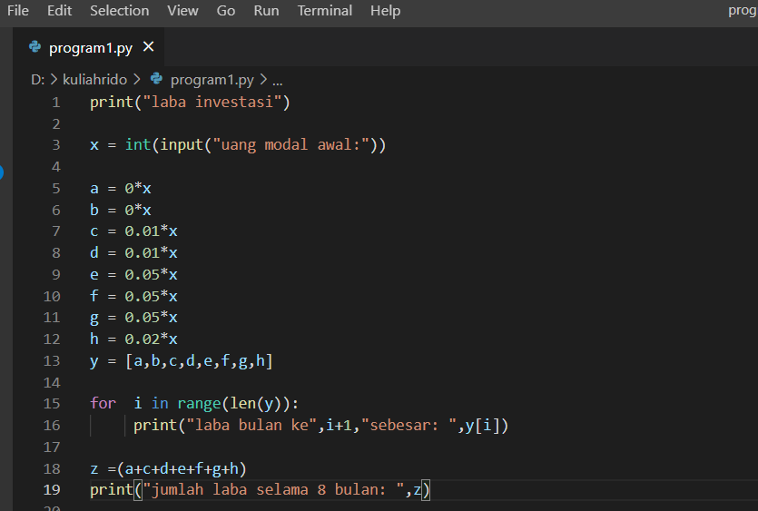
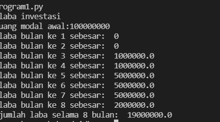

# labpy03
# Latihan 1 

## Program Untuk Menampilkan n Bilangan Acak Yang Lebih Kecil Dari 0.5

### Flowchart Program
#### berikut flowchart dari program latihan 1, untuk menampilkan n bilangan acak yang lebih kecil dari 0.5

### berikut gambaran script programnya

### dan berikut hasil programnya saat di jalankan

# Latihan 2

## Program Untuk Menampilkan n Bilangan Acak Yang Lebih Kecil Dari 0.5

### Flowchart Program
#### berikut flowchart dari program latihan 1, untuk menampilkan n bilangan acak yang lebih kecil dari 0.5

#### berikut gambaran programnya

### dan berikiut hasil programnya setealh di jalankan

# Program 1
## Program untuk menghitung laba investasi

### Flowchart program
#### berikut flowchart dari program menghitung laba investasi

### Penjelasan alur program

print("Laba Investasi") - adalah untuk menampilkan judul

x = int(input("Uang Modal Awal: ")) - adalah untuk menginput nilai x sebagai modal awal

a = 0*x - a adalah bulan pertama, karena bulan pertama belum memiliki laba, jadi masih 0 dikali dengan x nilai uang modal awal

b = 0*x - b adalah bulan kedua, karena bulan kedua belum memiliki laba, jadi nilai x dari uang modal dikali dengan 0

c = 0.01*x - c adalah bulan ketiga, dan sudah memiliki laba 1%, jadi ditulis 0.01 bentuk sederhana dari 1% dikali dengan modal atau uang awal dengan nilai x

d = 0.01*x - d adalah bulan keempat, dan labanya 1%, jadi ditulis 0.01 dikalikan dengan nilai x yang adalah uang awal atau modal

e = 0.05*x - e adalah bulan kelima, dan laba pada bulan kelima sebesar 5%, maka ditulis 0.05 dikalikan dengan nilai x untuk nilai uang awal atau modal

f = 0.05*x - f adalah bulan keenam, dan laba pada bulan keenam sebesar 5%, maka ditulis 0.05 dikalikan dengan nilai x untuk nilai uang awal atau modal

g = 0.05*x - g adalah bulan ketujuh, dan laba pada bulan ketujuh sebesar 5%, maka ditulis 0.05 dikalikan dengan nilai x untuk nilai uang awal atau modal

h = 0.02*x - h adalah bulan kedelapan, dan laba pada bulan kedelapan sebesar 2%, maka ditulis 0.02 dikalikan dengan nilai x untuk nilai uang awal atau modal

y=[a,b,c,d,e,f,g,h] - adalah untuk menentukan syarat y yang berisi a,b,c,d,e,f,g,h

for i in range(len(y)): - adalah untuk perulangan data dengan isi data y, dengan menampilkan urutan laba perbulan sesuai range yang di tentukan dengan hasil ke urutan yang diinputkan dari data y

    print("Laba Bulan Ke",i+1 ,"sebesar: ",y[i]) - untuk menampilkan hasil laba dari bulan ke 1 sampai terakhir

z=(a+b+c+d+e+f+g+h) - Z untuk data yang berisi hasil penjumlahan laba dari bulan pertama sampai bulan ke delapan

print("Jumlah Laba Selama 8 Bulan: ",z) - menampilkan hasil dari jumlah laba

#### berikut gambaran programnya

#### berikut hasil dari program setelah dijalankan
