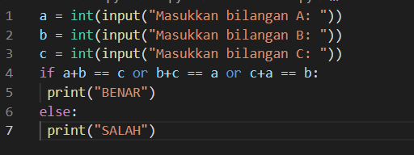

| Nama | kelas | Nim | Matkul |
| -- | --- | ---- | ----------- |
| AHMAD RIDHO |  TI.21.C. | 312110279 | Bahasa Pemrograman |
# modul praktikum 2
## latihan1
## Program menentukann nilai akhir

#### penjelasan alur program
Masukan program untuk menentukann nilai akhir

1.     print("Program menentukan nilai akhir") - adalah perintah untuk menampilkan judulnya.

2.        nama = input("Masukan nama:") - adalah perintah untuk menginput nama

3.       uts = input("Masukan nilai UTS:") - adalah perintah untuk menginput nilai  UTS

4.      uas = input("Masukan nilai UAS:") -  adalah perintah untuk menginput nilai UAS

5.       tugas = input("Masukan nilai tugas:") - adalah perintah unntuk menginput nilai tugas

6.      akhir = (int(tugas) * .2) + (int(uts) * .4) + (int(uas) * .4) - adalah perintah untuk menghitung nilai akhir

7.     keterangan = ("TIDAK LULUS","LULUS")[akhir> 60.0] - adalah perintah untuk mengeluarkan pernyataan lulus atau tidak lulus

8.     if akhir > 80: - adalah perintah untuk tipe data if atau jika, 80 adalah input nilai minimal untuk integer

9.     huruf = "A" - adalah program untuk menampilkan huruf "A" jika nilai yang dimasukan lebih dari 80

10.     elif akhir > 70: - adalah perintah untuk tipe data elif atau alternatif, 70 adalah input niai minimal untuk integer 

11.     huruf = "B" - adalah program untuk menampilkan huruf "B" jika nilai yang dimasukan lebih dari 70 dan kurang dari 80

11. elif akhir > 50: - adalah perintah untuk tipe data elif atau  alternatif, 50 adalah input nilai minimal untuk integer

12.     huruf = "C" - adalah proogram unntuk menampilkan huruf "C" jika nilai yang di masukan lebih dari 50 dan kurang dari 70

13.     elif akhir > 40: - addalah perintah untuk tipe data elif atau alternatif, 40 adalah input nilai minimal untuk integer

14.     huruf = "D" - adalah program untuk menampilkan huruf "D" jika nilai yang di masukan lebih dari 40 dan kurang dari 50

15.     else: - adalah perintah untuk tipe data else atau lain

16.     huruf = "E" - adalah program unntuk menampilkann huruf "E" jika nilai yang di masukan kurang dari 40

17.     print("\nNama       :",nama) - adalah perintah unntukk menampilkan nama yang telah di input

18.      print("Nilai UTS    :",uts) - adalah perintah untuk menampilkan nilai UTS yang telah di input

19.      print("Nilai UAS    :",uas) - adalah perintah untuk menampilkam nilai UAS yang telah di input

20.      print("Nilai Tugas  :",tugas) - adalah perintahh untuk menampilkan nilai tugas yang telah di input

21.     print("Nilai Akhir  :",akhir) - adalah perintah untuk menampilkan nilai akhir sesuai perhitungan yang telah dibuat

22.     print("\nNilai Huruf    :",huruf) - adalah perintah untuk menampilkan huruf sesuai dengan nilai akhir yang keluar

23.     print("Keterangan   :",keterangan) - adalah perintah untuk menampilkan keterangan LULUS atau TIDAK LULUS

#### Berikut contoh gambar programnya

#### setealh di run kemudian hasil nya aka seperti dibawah ini

## latihan 2
Masukan program untuk menampilkan status gaji karyawan seperti berikut

1.     print("Program menampilkan status gaji karyawan") - adalah perintah untuk menampilkann judulnnya

2.      gaji = int(input("Masukann gaji:")) - adalah perintah untuk menginput gaji

3.      berkeluarga = (False, True)[input("Sudah berkeluarga? (Y/T)") == "Y"] - adalah program untuk menentukan status berkeluarga dengan ketentuan False, True dan menampilkan pertanyaan "sudah berkeluarga?" lalu dinyatakan dengan pilihan Y/T

4.       punya_rumah = (False, True)[input("Punya rumah? (Y/T)") == "Y"] - adalah program untuk menentukan status punya_rumah dengan ketentuan False, True dan menampilkan pertanyaan "punya rumah?" lalu dinyatakan dengan piliham Y/T

5.     if gaji > 3000000: - adalah perintah untuk tipe data if atau jika gaji diatas 3000000

6.     print ("Gaji sudah diatass UMR") - adalah perintah untuk menampilkan hasil jika gaji yang diinput lebih dari 3000000

7.     if berkeluarga: - adalah perintah untuk tipe data if atau jika sudah berkeluarga

8.      print ("- Wajib ikutan asuransi dan menabung untuk pensiun") - adalah perintah untuk menampilkan hasil jika sudah berkeluarga

9.     else: - adalah perintah unntuk tipe data else atau lain

10.         print ("- Tidak perlu ikutan asuransi") -adalah perintah untuk menampilkan hasil jika belum berkeluarga atau hasil lain yang diinput

11.     if punya_rumah: - adalah perintah untuk tipe data if atau jika sudah punya rummah

12.         print ("- Wajib bayar pajakk rummah") - adalah perintah untuk menampilkan hasil jika sudah punya rumah

13.     else: - adalah perintah untuk tipe data else atau lain

14.         print ("- Tidak wajib bayar pajak rumah") - adalah perintah untuk menampilkan hasil jika belum punya rumah atau hasil lain yang diinput

15.      else: - adalah perintah untuk tipe data else atau lain

16.     print ("gaji belum UMR") - adalah perintah untuk menampilkan hasil langsung jika gaji yang diinput dibawah 3000000

#### Berikut contoh programnya

#### setelah di running maka hasilnya akan seperti di bawah ini

## latihan 3
### penggunaan kondisi or

 a = int(input("Masukkan bilangan A: ")) adalah untuk menginput bilangan a 

<b> = int(input("Masukkan bilangan B: ")) untuk menginput bilangan b 

c = int(input("Masukkan bilangan C: ")) untuk bilangan bilangan c 

if a+b == c or b+c == a or c+a == b:   if berfungsi jika kondisi bernilai true yg dimana akan menampilkan 

 print("benar")

 else: sedangkan  else berfunsi untuk mengeksekusi jika if bernilai false 

dan akan menampilkan print("salah")

#### berikuit contoh program nya

#### dan setealah  3 inputan bilangan telah di masukan kemudian running kan maka akan menghasilakn seperti dibawah ini

## tugas praktikum 2
### langkah membuat program sederhana menampilkan bilangan terbesar dari 3 buah bilangan menggunakan statement if

untuk kasus  dengan banyak kondisi,if tetap dapat digunakan dengan menggunakan if bersarang (nasted if).sebagai
contoh saya akan membuat program sederhana menampilkan bilangan terbesar dari 3 buah bilangan

A.untuk mencari bilangan terbesar dari 3 bilangan algoritmanya yang dimasukkan akan membandingkan terlebih dahulu
 apakah a>b.

B.jika a>b,maka ada 2  kadidat bilangan terbesar,yaitu a dan c sehingga perlu dilakukan pengujian yang manakah
 dari a dan c yang lebih besar dengan melakukan membandingkan nilai b dan c. jika nilai b ternyata lebih besar dari c,
 maka bilangan terbesar adalah a.nilai terbesar adalah c jika ternyata c lebih besar dari dari a.

C.jika kondisi a>b tidak terpenuhui(atau b<=a),maka 2 kadidat bilangan terbesar  adalah b dan c.jika nilai c ternyata 
 lebih kecil dari a,maka b adalah nilai terbesar,sedangakan jika c yang lebih besar dari b,maka yang terbesar adalah c.

 ## bisa di perhatikan flowchart berikut

 

 ## dan berikut contoh program nya

 ! [Gambar 8](labpy02/screnshot/ss7_module.png)

 ## dan setelah di run maka akan menghasilkan seperti di bawah ini

 
 

# modul praktikum 3
# Latihan 1 

## Program Untuk Menampilkan n Bilangan Acak Yang Lebih Kecil Dari 0.5

### Flowchart Program
#### berikut flowchart dari program latihan 1, untuk menampilkan n bilangan acak yang lebih kecil dari 0.5

### berikut gambaran script programnya

### dan berikut hasil programnya saat di jalankan

# Latihan 2

## Program Untuk Menampilkan n Bilangan Acak Yang Lebih Kecil Dari 0.5

### Flowchart Program
#### berikut flowchart dari program latihan 1, untuk menampilkan n bilangan acak yang lebih kecil dari 0.5

#### berikut gambaran programnya

### dan berikiut hasil programnya setealh di jalankan

# Program 1
## Program untuk menghitung laba investasi

### Flowchart program
#### berikut flowchart dari program menghitung laba investasi

### Penjelasan alur program

print("Laba Investasi") - adalah untuk menampilkan judul

x = int(input("Uang Modal Awal: ")) - adalah untuk menginput nilai x sebagai modal awal

a = 0*x - a adalah bulan pertama, karena bulan pertama belum memiliki laba, jadi masih 0 dikali dengan x nilai uang modal awal

b = 0*x - b adalah bulan kedua, karena bulan kedua belum memiliki laba, jadi nilai x dari uang modal dikali dengan 0

c = 0.01*x - c adalah bulan ketiga, dan sudah memiliki laba 1%, jadi ditulis 0.01 bentuk sederhana dari 1% dikali dengan modal atau uang awal dengan nilai x

d = 0.01*x - d adalah bulan keempat, dan labanya 1%, jadi ditulis 0.01 dikalikan dengan nilai x yang adalah uang awal atau modal

e = 0.05*x - e adalah bulan kelima, dan laba pada bulan kelima sebesar 5%, maka ditulis 0.05 dikalikan dengan nilai x untuk nilai uang awal atau modal

f = 0.05*x - f adalah bulan keenam, dan laba pada bulan keenam sebesar 5%, maka ditulis 0.05 dikalikan dengan nilai x untuk nilai uang awal atau modal

g = 0.05*x - g adalah bulan ketujuh, dan laba pada bulan ketujuh sebesar 5%, maka ditulis 0.05 dikalikan dengan nilai x untuk nilai uang awal atau modal

h = 0.02*x - h adalah bulan kedelapan, dan laba pada bulan kedelapan sebesar 2%, maka ditulis 0.02 dikalikan dengan nilai x untuk nilai uang awal atau modal

y=[a,b,c,d,e,f,g,h] - adalah untuk menentukan syarat y yang berisi a,b,c,d,e,f,g,h

for i in range(len(y)): - adalah untuk perulangan data dengan isi data y, dengan menampilkan urutan laba perbulan sesuai range yang di tentukan dengan hasil ke urutan yang diinputkan dari data y

    print("Laba Bulan Ke",i+1 ,"sebesar: ",y[i]) - untuk menampilkan hasil laba dari bulan ke 1 sampai terakhir

z=(a+b+c+d+e+f+g+h) - Z untuk data yang berisi hasil penjumlahan laba dari bulan pertama sampai bulan ke delapan

print("Jumlah Laba Selama 8 Bulan: ",z) - menampilkan hasil dari jumlah laba

#### berikut gambaran programnya

#### berikut hasil dari program setelah dijalankan

